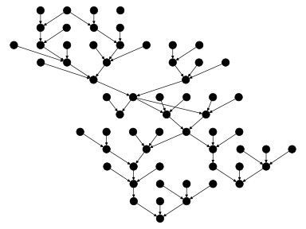
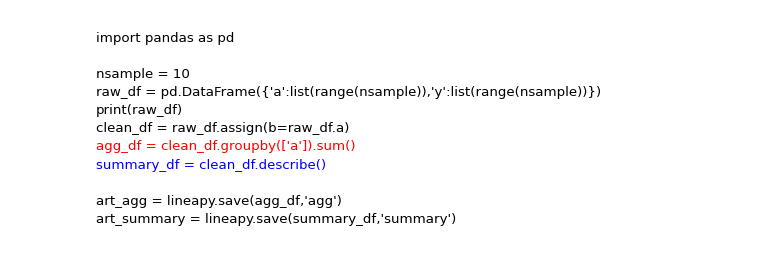
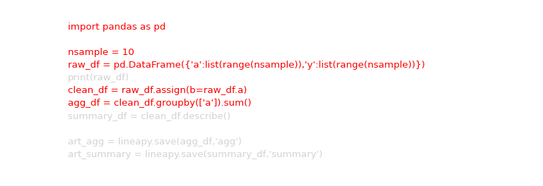
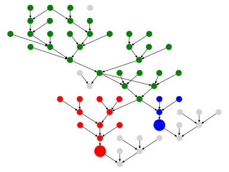
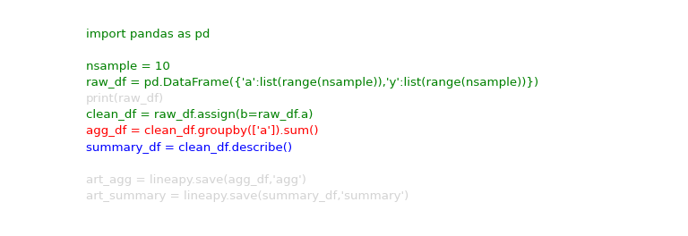

# Code Refactoring with LineaPy

In this post, we explain how LineaPy code slicing and refactoring work with minimal computer science knowledge.

But let's still start with some computer science and this is the only computer science we need to know to underestand rest of the post. In computer science, code can be represented as some graph structures. 
For instance, abstract syntax tree(AST) is a tree, connected acyclic graph, representation of the abstract syntactic structure of program code. LineaPy is also powered by a graph stucture called Linea Graph. Similiar to AST, Linea Graph is a graph representation of program code.

All we need to know here is each Linea Graph can be represented as a piece of code and vice versa.

Let's start form following piece of code:

``` python
import pandas as pd

nsample = 10
raw_df = pd.DataFrame({'a':list(range(nsample)),'y':list(range(nsample))})
print(raw_df)
clean_df = raw_df.assign(b=raw_df.a)
agg_df = clean_df.groupby(['a']).sum()
summary_df = clean_df.describe()

art_agg = lineapy.save(agg_df,'agg')
art_summary = lineapy.save(summary_df,'summary')
```

When we run above code in LineaPy, LineaPy will construct a Linea Graph that represents the code as following:

| LineaGraph | Code |
:-----------------:|:-----------------------:|
 |   

Note that, each node in the Linea Graph might has different propertiers in our implementation but we don't need to go to the detail here to achieve the goal of this post. 
Thus, we use the same dot style to represent all nodes for simplicity.

At the end of the code, there are two `lineapy.save` statements to save objects(`agg_df` and `summary_df`) as artifacts(`agg` and `summary`).
These statements tell LineaPy to mark nodes in the Linea Graph that represent these two objects as following:

| LineaGraph | Code |
:-----------------:|:-----------------------:|
 | 

## Code Slicing

If we focus on the first artifact, `agg`, and highlight all predecessors of the value node in red we can have a subgraph and corresponding code like

| LineaGraph | Code |
:-----------------:|:-----------------------:|
 |   

Note that, the highlighted code is exactly the result we get from LineaPy `get_code` API; i.e., if we run following code

``` python
print(art_agg.get_code())
```

we should see below result.

``` output
import pandas as pd

nsample = 10
raw_df = pd.DataFrame({"a": list(range(nsample)), "y": list(range(nsample))})
clean_df = raw_df.assign(b=raw_df.a)
agg_df = clean_df.groupby(["a"]).sum()
```

Similarly, if we focus on the second artifact, `summary`, and highlight all predecessors of the value node in blue we can have a subgraph and corresponding code like

| LineaGraph | Code |
:-----------------:|:-----------------------:|
 |   

## Code Refactoring

Now, when we try to create a pipeline that produce the two artifacts(`agg` and `summary`). 
We can just execute codes we obtain from `art_agg.get_code()` and `art_summary.get_code()` separately.
However, we can easily find out this is not idea because part of the code has been executed twice because they are common to both artifacts. 
What it mean in Linea Graph is there is a overlapping between subgraphs for `agg` and `summary`. 
Thus, we can separate common nodes from the two subgraphs as a new subgraph(as green) and corresponding code like

| LineaGraph | Code |
:-----------------:|:-----------------------:|
 |   

This is exactly why we see there are three functions exist in the module file LineaPy creates when we run `lineapy.to_pipeline(['agg','summary'])`; i.e., we we run

``` python
print(lineapy.get_module_definition(['agg','summary']))
```

we will see

```
import pandas as pd


def get_clean_df_for_artifact_summary_and_downstream():
    nsample = 10
    raw_df = pd.DataFrame({"a": list(range(nsample)), "y": list(range(nsample))})
    clean_df = raw_df.assign(b=raw_df.a)
    return clean_df


def get_summary(clean_df):
    summary_df = clean_df.describe()
    return summary_df


def get_agg(clean_df):
    agg_df = clean_df.groupby(["a"]).sum()
    return agg_df


def run_session_including_summary():
    # Given multiple artifacts, we need to save each right after
    # its calculation to protect from any irrelevant downstream
    # mutations (e.g., inside other artifact calculations)
    import copy

    artifacts = dict()
    clean_df = get_clean_df_for_artifact_summary_and_downstream()
    summary_df = get_summary(clean_df)
    artifacts["summary"] = copy.deepcopy(summary_df)
    agg_df = get_agg(clean_df)
    artifacts["agg"] = copy.deepcopy(agg_df)
    return artifacts


def run_all_sessions():
    artifacts = dict()
    artifacts.update(run_session_including_summary())
    return artifacts


if __name__ == "__main__":
    # Edit this section to customize the behavior of artifacts
    artifacts = run_all_sessions()
    print(artifacts)
```

where `get_clean_df_for_artifact_summary_and_downstream` is corresponding to the green subgraph, `get_agg` is corresponding to the red subgraph, and `get_summary` is corresponding to the blue subgraph.

## Final Thought

We've demonstrated the basic idea behind how code slicing and refactoring works in LineaPy. 
If you are interested in more detail about LineaPy Graph you can go to 
[LineaPy Internals](https://docs.lineapy.org/en/latest/references/internals.html). 
If you are interested in more information about LineaPy in general you can go to our [GitHub Page](https://github.com/LineaLabs/lineapy).


